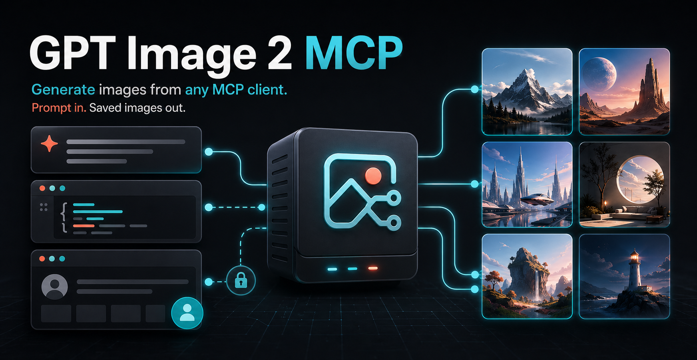
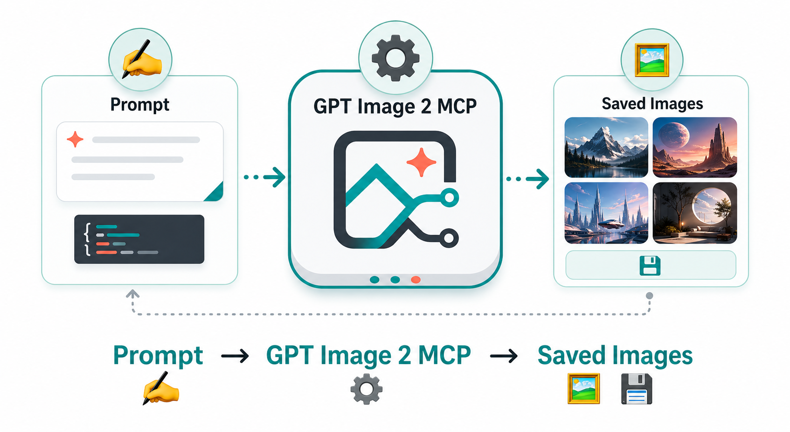
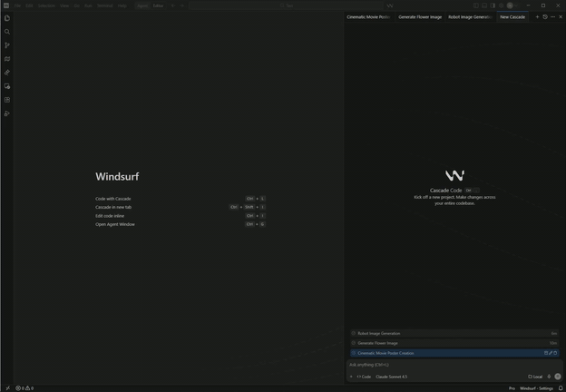
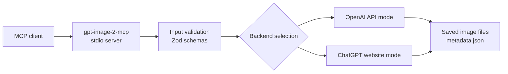
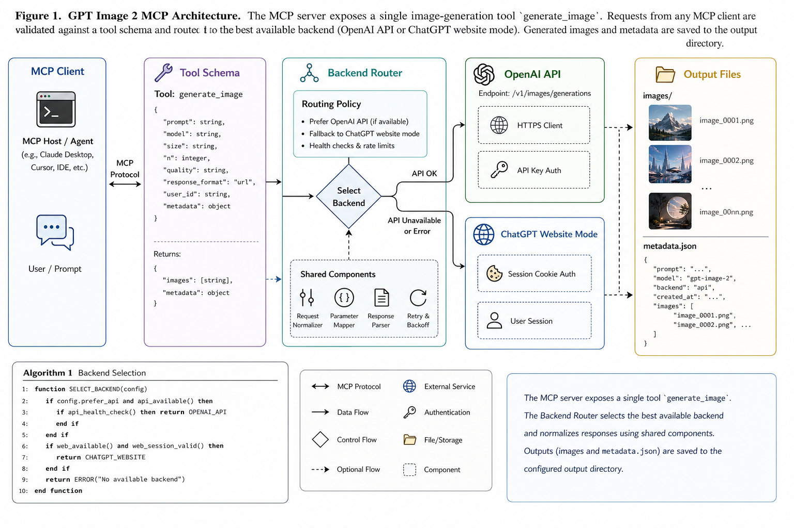

# @ramlyburger/gpt-image-2-mcp

<p align="center">
  
</p>

Turn any MCP-compatible AI client into an image generator. Send a normal prompt, choose a backend mode, and get real saved image files back.

## 🖼️ What It Does

- ✍️ **Prompt in:** ask for an image from your MCP client.
- ⚙️ **MCP server runs:** `gpt-image-2-mcp` handles the image request.
- 💾 **Files out:** every result includes `output_dir`, `image_path`, and metadata.
- 🔐 **No ChatGPT API key needed** in `chatgpt-web` mode. You only need a ChatGPT account and a successful sign-in at [chatgpt.com](https://chatgpt.com/).

<p align="center">
  
</p>

## 🚀 Quick Start

Add the server to your MCP client:

```json
{
  "mcpServers": {
    "gpt-image-2": {
      "command": "npx",
      "args": ["-y", "@ramlyburger/gpt-image-2-mcp"],
      "env": {
        "GPT_IMAGE_BACKEND": "chatgpt-web"
      }
    }
  }
}
```

That is enough for the ChatGPT website mode. The first run opens ChatGPT so you can sign in or complete verification. After that, the local profile can be reused across restarts.

For direct API generation, set `OPENAI_API_KEY` and change `GPT_IMAGE_BACKEND` to `api`.

## 🧭 Pick A Mode

| Mode | What you need | Best when | Notes |
| --- | --- | --- | --- |
| `chatgpt-web` | A ChatGPT account and sign-in at `chatgpt.com` | You want a simple setup without a ChatGPT API key | Good beginner default |
| `api` | `OPENAI_API_KEY` | You want the direct API path | Uses `gpt-image-2` |
| `auto` | Preferably an API key; otherwise a usable ChatGPT website session | You want API first with fallback behavior | Tries API first, then falls back only when the API backend is unavailable |

## 🎬 Demo

[](./assets/demo.mp4)

Click the GIF to open the full MP4.

## 🧰 Tool Surface

- `generate_image(prompt, backend?, n?, size?, quality?, output_format?, conversation_mode?, timeout_seconds?)`
- `backend_status(backend?)`
- `browser_visibility(action?, start_browser?)`

Backend values are `api`, `chatgpt-web`, or `auto`.

Use `conversation_mode="new"` or `conversation_mode="continue"` with the ChatGPT website mode.

## 📄 Technical Reference

The section below is the implementation-oriented view.

### Figure 1. System Model



<p align="center">
  
</p>

### Abstract

`gpt-image-2-mcp` is a small TypeScript MCP server that exposes image generation through a narrow tool contract. The server validates MCP tool input, resolves the requested backend, persists generated artifacts to disk, and returns structured metadata plus image content to the caller.

### Method

The implementation follows a five-stage pipeline:

1. parse and validate MCP tool input
2. resolve the backend from `api`, `chatgpt-web`, or `auto`
3. execute the selected image-generation path
4. write generated images and `metadata.json` to a prompt-derived output directory
5. return `output_dir`, `image_path`, `images`, and backend metadata

The `auto` mode attempts the API backend first and falls back to `chatgpt-web` only when the API backend is unavailable.

### Artifact Model

Each generation creates one output directory. Images are written as numbered files such as `image-01.png`, and metadata is written beside them.

Default output roots:

```text
Windows: %LOCALAPPDATA%\gpt-image-2-mcp\output\chatgpt-images
macOS:   ~/Library/Application Support/gpt-image-2-mcp/output/chatgpt-images
Linux:   ${XDG_DATA_HOME:-~/.local/share}/gpt-image-2-mcp/output/chatgpt-images
```

Operational notes:

- `backend_status` returns the effective `output_root`
- `generate_image` returns `output_dir`, `image_path`, and the full `images` array
- image filenames are deterministic within one output directory: `image-01`, `image-02`, and so on
- metadata is written as JSON alongside the image files

### ChatGPT Website Mode

Run the server in ChatGPT website mode:

```powershell
$env:GPT_IMAGE_BACKEND = "chatgpt-web"
node dist/index.js
```

When the server starts, it opens ChatGPT in Chrome or Edge. Sign in or complete verification there. Once the normal composer is visible, the session is ready for tool calls. No ChatGPT API key is required for this mode.

The local ChatGPT sign-in profile is stored under the same per-user app data directory by default. Override it with:

```powershell
$env:CHATGPT_WEB_PROFILE_DIR = "C:\path\to\profile"
```

Optional settings:

```powershell
$env:CHATGPT_WEB_LOGIN_TIMEOUT_SECONDS = "900"
$env:CHATGPT_HIDE_WINDOW = "0"
```

`CHATGPT_HIDE_WINDOW` defaults to enabled. The ChatGPT window stays visible for login or verification, then hides after `chatgpt.com` is ready. Use `0` if you want the window to remain visible after sign-in.

### API Mode

Run the server in direct API mode:

```powershell
$env:OPENAI_API_KEY = "sk-..."
$env:GPT_IMAGE_BACKEND = "api"
node dist/index.js
```

This mode uses the configured OpenAI image model directly. By default the model is `gpt-image-2`, and the selected output format can be `png`, `jpeg`, or `webp`.

### Tool Contract

`generate_image` returns a structured result with these important fields:

- `status`
- `requested_backend`
- `backend`
- `fallback_from`
- `prompt`
- `output_dir`
- `image_path`
- `images`
- `metadata`

`backend_status` returns readiness and configuration information for the selected backend or for both backends when `auto` is requested.

`browser_visibility` controls the visibility of the ChatGPT window and can also start the ChatGPT session when requested.

### Local Development

The TypeScript MCP server is the only supported entry point.

Install and build:

```powershell
npm install
npm run build
```

Useful local commands:

```powershell
npm run typecheck
npm run build
npm run start
```

### Repository Notes

- `src/index.ts` registers the MCP tools
- `src/config.ts` resolves environment-driven configuration
- `src/backends/` contains backend implementations and selection logic
- `src/output.ts` is responsible for output-directory naming and file writes

The public MCP surface stays intentionally small while backend-specific behavior remains isolated in the backend layer.
