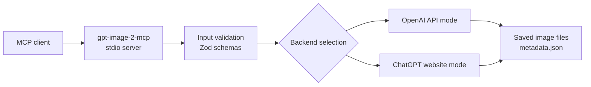

# @ramlyburger/gpt-image-2-mcp

<p align="center">
  
</p>

<p align="center">
  Generate images from any MCP-compatible AI client through one small stdio server.
</p>

<p align="center">
  
</p>

Use this when you want your MCP client to request images the same way it requests code or text: send a prompt, choose a mode, and get real saved image files back.

## What This Gives You

- one MCP server with a simple image-generation tool surface
- official OpenAI API support through `gpt-image-2`
- a ChatGPT website mode that does not require a ChatGPT API key
- exact output directories and image paths in every saved result
- a reusable local ChatGPT sign-in profile across restarts

<p align="center">
  
</p>

## Quick Start

Add the server to your MCP client:

```json
{
  "mcpServers": {
    "gpt-image-2": {
      "command": "npx",
      "args": ["-y", "@ramlyburger/gpt-image-2-mcp"],
      "env": {
        "GPT_IMAGE_BACKEND": "chatgpt-web"
      }
    }
  }
}
```

This starts in `chatgpt-web` mode. In this mode you do not need a ChatGPT API key. You only need a ChatGPT account and a successful sign-in at [chatgpt.com](https://chatgpt.com/).

If you want direct API generation instead, set `OPENAI_API_KEY` and change `GPT_IMAGE_BACKEND` to `api`.

## Which Mode Should You Pick?

| Mode | What you need | Best when | Notes |
| --- | --- | --- | --- |
| `chatgpt-web` | A ChatGPT account and sign-in at `chatgpt.com` | You want a simple setup without a ChatGPT API key | Good beginner default |
| `api` | `OPENAI_API_KEY` | You want the direct API path | Uses `gpt-image-2` |
| `auto` | Preferably an API key; otherwise a usable ChatGPT website session | You want API first with fallback behavior | Tries API first, then falls back only when the API backend is unavailable |

## Demo

[](./assets/demo.mp4)

Click the GIF to open the full MP4.

## Tool Surface

- `generate_image(prompt, backend?, n?, size?, quality?, output_format?, conversation_mode?, timeout_seconds?)`
- `backend_status(backend?)`
- `browser_visibility(action?, start_browser?)`

Backend values are `api`, `chatgpt-web`, or `auto`.

Use `conversation_mode="new"` or `conversation_mode="continue"` with the ChatGPT website mode.

## Technical Reference

The remainder of this document is written as an implementation-oriented reference. If you only need setup, the sections above are enough.

### 1. System Model

The package exposes a TypeScript MCP server over stdio. The server validates tool inputs, resolves the backend, writes output artifacts to a per-user data directory, and returns both structured metadata and image content to the caller.



### 2. Conceptual Flow

At a high level, the server receives a prompt-like request, materializes a backend-specific generation call, persists the generated images to disk, and reports the saved paths back to the MCP client.

The implementation surface is intentionally narrow:

1. parse MCP tool input
2. choose the execution path
3. generate image output
4. persist image files and metadata
5. return a structured result

### 3. Backend Selection Semantics

The backend registry contains two concrete execution targets:

- `api`
- `chatgpt-web`

Selection behavior:

- `api`: call the OpenAI API backend directly
- `chatgpt-web`: use the local signed-in ChatGPT website session directly
- `auto`: attempt the API backend first and fall back to `chatgpt-web` only when the API backend is unavailable

This fallback behavior is implemented in the backend resolver rather than the README alone, so the operational semantics are stable across MCP clients.

### 4. Output Persistence Model

Each generation creates a prompt-derived output directory and writes numbered image files such as `image-01.png` plus `metadata.json`.

Default output roots:

```text
Windows: %LOCALAPPDATA%\gpt-image-2-mcp\output\chatgpt-images
macOS:   ~/Library/Application Support/gpt-image-2-mcp/output/chatgpt-images
Linux:   ${XDG_DATA_HOME:-~/.local/share}/gpt-image-2-mcp/output/chatgpt-images
```

Operational notes:

- `backend_status` returns the effective `output_root`
- `generate_image` returns `output_dir`, `image_path`, and the full `images` array
- image filenames are deterministic within one output directory: `image-01`, `image-02`, and so on
- metadata is written as JSON alongside the image files

### 5. ChatGPT Website Mode

Run the server in ChatGPT website mode:

```powershell
$env:GPT_IMAGE_BACKEND = "chatgpt-web"
node dist/index.js
```

When the server starts, it opens ChatGPT in Chrome or Edge. Sign in or complete verification there. Once the normal composer is visible, the session is ready for tool calls. No ChatGPT API key is required for this mode.

The local ChatGPT sign-in profile is stored under the same per-user app data directory by default, so the login state can be reused across restarts. Override with:

```powershell
$env:CHATGPT_WEB_PROFILE_DIR = "C:\path\to\profile"
```

Optional settings:

```powershell
$env:CHATGPT_WEB_LOGIN_TIMEOUT_SECONDS = "900"
$env:CHATGPT_HIDE_WINDOW = "0"
```

`CHATGPT_HIDE_WINDOW` defaults to enabled. The ChatGPT window stays visible for login or verification, then hides after `chatgpt.com` is ready. Use `0` if you want the window to remain visible after sign-in.

If the MCP profile is still open from a previous session, startup stops before launching another Chrome instance against the same profile. This prevents extra startup tabs and avoids profile contention.

### 6. API Mode

Run the server in direct API mode:

```powershell
$env:OPENAI_API_KEY = "sk-..."
$env:GPT_IMAGE_BACKEND = "api"
node dist/index.js
```

This mode uses the configured OpenAI image model directly. By default the model is `gpt-image-2`, and the selected output format can be `png`, `jpeg`, or `webp`.

### 7. Tool Contract Summary

`generate_image` returns a structured result with these important fields:

- `status`
- `requested_backend`
- `backend`
- `fallback_from`
- `prompt`
- `output_dir`
- `image_path`
- `images`
- `metadata`

`backend_status` returns readiness and configuration information for the selected backend or for both backends when `auto` is requested.

`browser_visibility` controls the visibility of the ChatGPT window and can also start the ChatGPT session when requested.

### 8. Local Development

The TypeScript MCP server is the only supported entry point.

Install and build:

```powershell
npm install
npm run build
```

Useful local commands:

```powershell
npm run typecheck
npm run build
npm run start
```

### 9. Repository Notes

This package is intentionally small:

- `src/index.ts` registers the MCP tools
- `src/config.ts` resolves environment-driven configuration
- `src/backends/` contains backend implementations and selection logic
- `src/output.ts` is responsible for output-directory naming and file writes

That separation is deliberate: the public MCP surface stays minimal while backend-specific complexity remains isolated in the backend layer.
